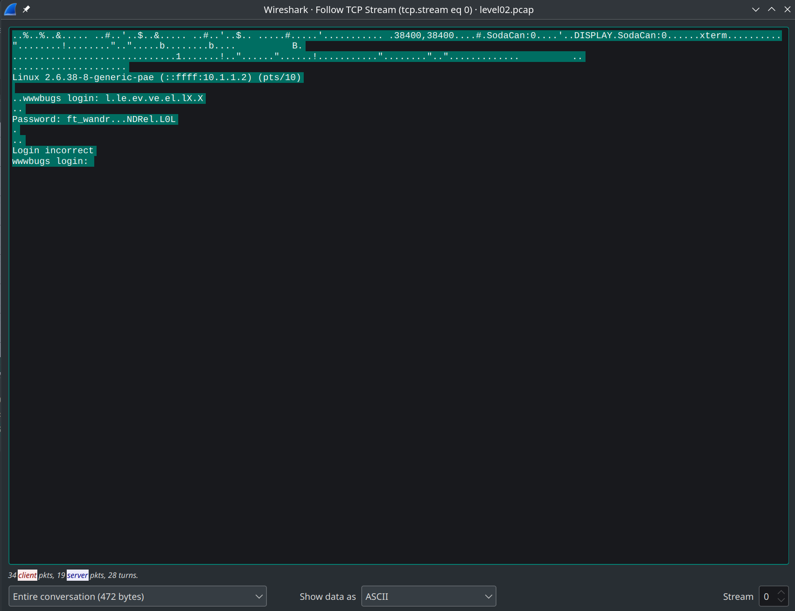

# Level02

En arrivant sur le level, nous voyant un fichier level02.pcap, qui est un fichier de capture de paquets, nous allons donc l'ouvrir avec wireshark.

A comme nous le voyons sur wireshark, nous pouvons seulement suivre le stream TCP.

Nous obtenons donc:

En changeant le format d'affichage en Hex Dump, nous obtenons:

Le password est donc `ft_wandr...NDRel.L0L`.
Les `.` sont des caracteres non affichables.
En regardant leurs valeurs en ASCII, nous voyons que ce sont '7F', qui est le caractere 'DEL', qui permet de supprimer le caractere precedent.
En supprimant donc les caracteres 'DEL', nous obtenons le password `ft_waNDReL0L`.
(Et le login est `l` comme nous le voyons dans le stream TCP)
