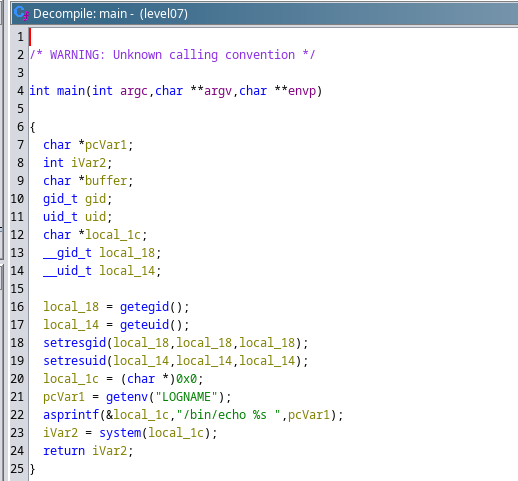

En ouvrant l'executable a disposition sur GHIDRA, nous voyons:


L'executable affiche dans le contenu de la variable d'environnement `LOGNAME` avec echo
Si nous modifions la variable d'environnement `LOGNAME` pour qu'elle execute un shell, nous pourrons executer des commandes.

```bash
level07@SnowCrash:~$ export LOGNAME=\`getflag\`
level07@SnowCrash:~$ ./level07
Check flag.Here is your token : fiumuikeil55xe9cu4dood66h
```
