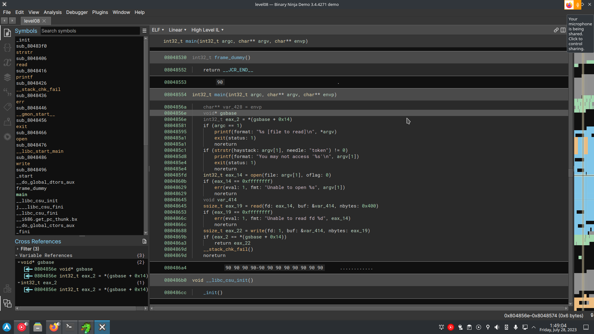

there is a token file in the home directory probably containing a flag.
opening the binary in binaryninja
 
we can see a check if the file is containing the string 'token'.
a simple way of bypassing this is to use a symlink, so that the name if different but still point to the same file :
`chmod 777 -R . && ln -s token test`
`./level08 test` -> `quif5eloekouj29ke0vouxean`
this gets us the password to connect to the flag08 account, and then launch getflag.
