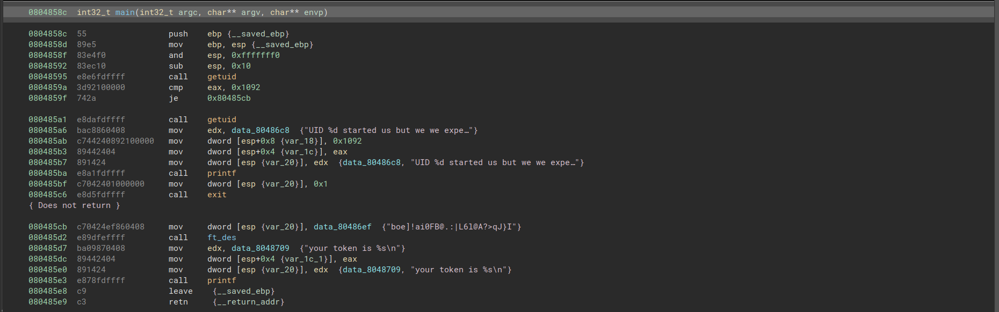

# Level 13

Nous avons a disposition un fichier, qui quand nous le lancons nous dit que le UID est 2013, et qu'ils voulaient 4242.

Quand nous l'inspectons avec binary-ninja, nous voyons un call a getuid, ainsi que le token, mais qui n'est pas visible.



Nous pouvons donc juste mettre un breakpoint sur getuid, et renvoyer une fausse valeur de retour.

```
b getuid
run
step -> to go at the return
print $eax
set $eax=4242
step
```

And we will see the token
