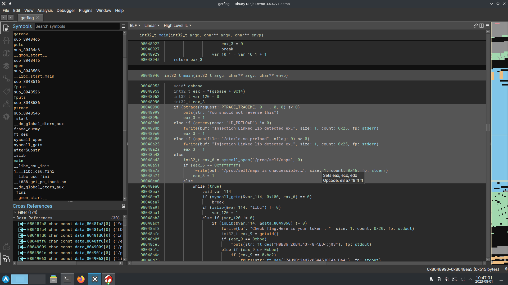
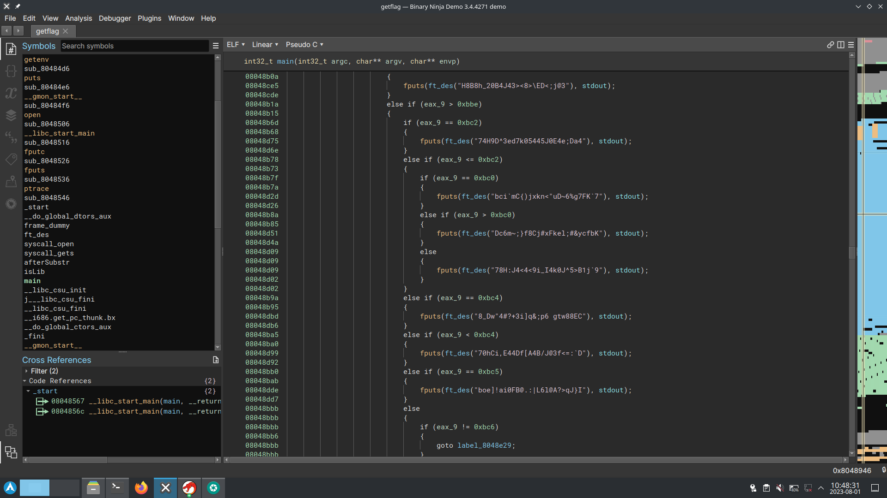
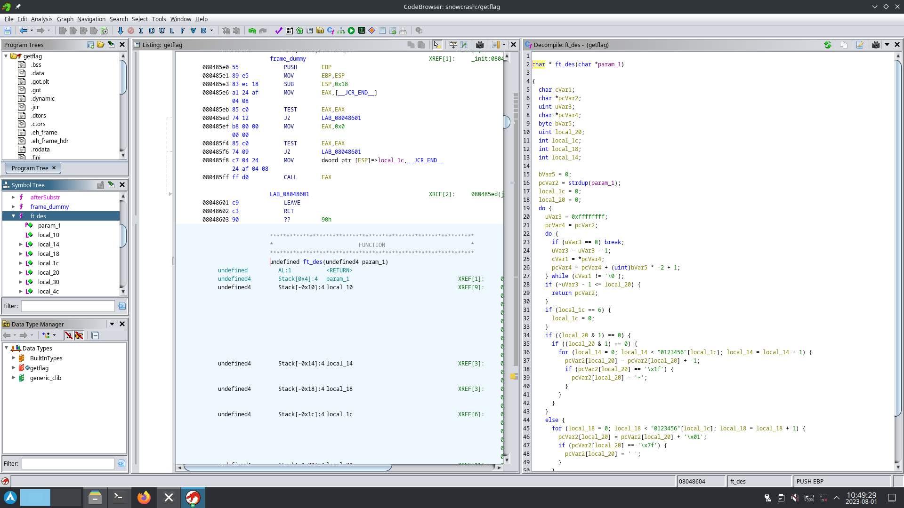

this last user don't have anything to exploit, which lets us with getflag. we will hack the command getflag itself.
there is probably multiple way of doing it. opening it in binaryninja we see multiple anti debugging measures :

after that a forest of if else that call the ft_des function with a token for each userid.
the ft_des function encode thoses token to give us the end flag.

if we can recreate the function ft_des, we can give it any token and get the flag for the level.
opening it in ghidra this time (binaryninja usually gives cleaner pseudo C code, but this time ghidra gave a better C code)

the code ghidra gives us can pratically be copy pasted into a C file, we just have to add import and small tweak to get it working (see getflag.c)
running ft_des with any token found in the forest of if else in getflag gives us the correct flag.

```shell
$ cc getflag.c && ./a.out 'g <t61:|4_|!@IF.-62FH&G~DCK/Ekrvvdwz?v|'
g <t61:|4_|62FH&G~DCK/Ekrvvdwz?v| -> 7QiHafiNa3HkawuYrTstxbpABHD8CPnHJ
```
